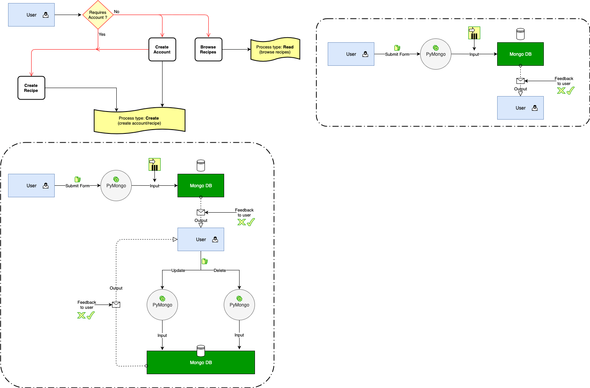

 

    

 

# [The Pâtisserie Journal](https://patisserie-cookbook.herokuapp.com)

Welcome!

[The Pâtisserie Journal](https://patisserie-cookbook.herokuapp.com) is an intuitive online cookbook tool to help you find new recipes and implement them interactively while cooking. You can also share your own recipes by creating an account and join our onlince community!

The purpose of this project is to make patisserie inclusive meaning that anyone with food allergies, specific diet or simply missing an ingredient or a cooking tool would be able to find a suitable recipe. 

By creating a community that can share their own recipes, it will enable us to naturally expand our database but also promote new "chefs" by providing them with visibility. 

## Table of Contents
1. [UX](#UX)
    - [User Stories](#)
        - [External Users](#)
        - [Site Owners](#)
    - [Design](#)
    - [Wireframes](#)
    - [Flowchart](#)

2. [Features](#)
    - [Current Features](#)
    - [Future Features](#)

3. [Database](#)
    - [Database choice](#)
    - [Data Structure](#)

4. [Technologies Used](#)

5. [Testing](#)

6. [Deployment](#)
    - [Heroku Deployment](#)
    - [Local Deployment](#)

7. [Credits](#)
    - [Content](#)
    - [Media](#)
    - [Code](#)
    - [Acknowledgements](#)

# UX

## User Stories

For this project, I identified the following stakeholders:
-	External users
-	Community members
-	The site owners

### External users

###### User story 1
 
As an external user, I want to make use of the site and benefit from having convenient access to the data provided by all community members.

###### User story 2

As an external user, I want to be able to research recipes based on specific criteria and have a visually appealing and interactive interface while I am cooking. 

###### User story 3

As an external user, I also want to be able to browse recipes by category types (meal, diet, occasion or geography) and then have a list of all the recipes available for the category I selected. 

###### User story 4

As a user with specific constraints (food allergies, specific diets or simply missing a cooking tool…), I want to be able to find recipes that address my needs and be presented recipes based on my inputs.

###### User story 5

As an external user, I want to be able to view the recipe instructions for all the recipes available in the database with the same level of details as a community member. I also want to be recommended some of the website creators' favorite recipes. 

###### User story 6

As an external user, I want to be able to share recipes on different social platforms as well as be able to print them. 

###### User story 7

As an external user, I want to be able to create a free account with minimal steps.

### Community members

###### User story 1

As a community member, I want to be able to log in with minimal steps by only using my email and password for authentication. I also want to be able to log out easily.

###### User story 2

As a community member, I want to be able to edit my information details, password and delete my account permanently if necessary.

###### User story 3

As a community member, I want to be able to create new recipes and then have the possibility to edit and/or to delete any of recipes that I have shared with the community.

###### User story 4

As a community member, I want to be able to add/remove a recipe to my favourites so I can create my own online cookbook. 

###### User story 5

Food lovers, wannabe cooks or anyone passionate about patisserie who wants to try out the success of their recipes.

### Site's owner

###### User story 1

Generally speaking we promote a cooking tool and benefit from the collection of the dataset as whole. 

###### User story 2

Be the first member of this community to share my own patisserie recipes!

###### User story 3

Building a full-stack website using Python and mini-framework Flask that allows me to apply my skills in databases handling and interactive design. 

## Design

### Theme

In terms of general layout, I wanted a classy style that would remind the user of an elegant French Pâtisserie. Therefore, I have decided to keep it very simple with no extravagant colours but instead use visually impacting images. I have therefore put a lot of efforts on selecting colourful and meaningful pictures for my website. This was very crucial to me as bakery pictures are made to draw user's attention and so combined with a very clogged styled website, it can be very overwhelming for the user. 

### Colors

- White - `#ffffff`
    - background
- Grey - `#444`
    - font color
- Pink - `#ee6e73`
    - major headlines
    - buttons & icons
- Light grey - `#333333`
    - footer

### Typography

In an effort to keep my layout smart but understated, I have decided to select one unique font family from Google Fonts called [Signika](https://fonts.google.com/?query=Signika). 

## Wireframes

I have used Balsamiq to create my wireframes. I first brainstormed on the structure and then created the site map. There are of course some differences with the final project as these wireframes were created during the preparation phase. 

You can find all my wireframes [here](static/wireframes/).

## Flowchart

    

# Features

## Current Features

#### Features for all users

###### Feature 1 - Home page
Any external user landing to the home page of this website will be presented with a general welcome page with the following features:
- Navigation bar with a logo and links to the different pages: Home, Explore, Recipes, About, Sign Up and Log In.
- Recipes teaser and a direct link to explore recipes directly by clicking on the headline.
- Short presentation of the online cookbook and a direct link to register by clicking on the "Join Us" headline.
- A direct link to the "About Us" section of the website.
- A footer with icon links to the following social media: Facebook, Instagram, YouTube, Pinterest, and Twitter (no actual account created as this is for education purpose only). 

###### Feature 2 - Search recipes using a form
- Users can search for recipes by filtering on any criteria provided within the form.
- Users can filter recipes based on the following criteria:
    - recipe difficulty
    - preparation time (selection)
    - max serving (direct input or increment arrow)
    - meal category (multiple selection allowed)
    - diet category (multiple selection allowed)
    - exclude allergens (multiple selection allowed)
    - exclude specific tools (multiple selection allowed)
    - occasion (multiple selection allowed)
    - geography (multiple selection allowed)
- Users have the possibility to leave some fields blank, this will not prevent the form from being submitted. The criteria for which the field was left blank will simply be disregarded. 
- Once the form is succesfully submitted, users will be presented with a list of the recipes matching his criteria. Users are provided with the number of recipes matching their search, and can click any recipe cards (with recipe name and a small picture) and will be redirected to the recipe description. 

###### Feature 3 - Browse recipes by categories type
- Users who are looking for inspiration or would like to search for recipes based on specific categories can actually do so.
- After clicking on the "Recipes" menu item in the navigation bar, users will be first presented with 4 general categories to "sort" recipes:
    - occasion
    - geography
    - diet
    - meal
- After selecting one of the previous categories, users can then choose to sort the recipes by sub-categories as follow:
    - occassion: Christmas, New Year's, Weddings...
    - geography: North America, Asia...
    - diet: Vegan, Vegeterian...
    - meal: Breakfast, Snacks...
- Once users have clicked the desired sub-category, they are then presented with a list of all the recipes matching their category and sub-category selection. Users can click on any recipe cards (with recipe name and a small picture) and will be redirected to the recipe description. 

###### Feature 4 - About us page
- Users can learn more about the purpose of this website.
- Users are provided with "fast-track" links to recipes, cookbook and sign in pages. 

###### Feature 5 - Sign up for an account
- Any external user can join the community by creating a new account with us.
- Users are provided with a simple sign up form requiring only basic information: First Name, Last Name, Email and Password (and confirmation).
- Before any account is created, the email provided by the user will be checked to ensure that an existing account is not already link to this email. 
- Users are provided with relevant feedback (flashed messages at the top of the page) if any field is missing or if any information provided is incorrect.
- User's password is hashed for security purposes.
- Once their account has been succesfully created, users are redirected to the log in page for authentication. 

###### Feature 6 - View recipe description
[C**R**UD] - **R**ead
- Be it as a result of the "explore" recipes form or of the "recipes" categories section, users will be able to view the following information:
    - recipe name and description (if any)
    - serving size
    - diet compatibility
    - difficulty
    - preparation time
    - ingredients list
    - cooking tools
    - preparation setps
- Users will also have the following additional options:
    - button to share the recipe on a wide range of social media
    - button to print the recipe
    - option to check out the website creators' favorite recipes

#### (Additional) Features for community members

###### Feature 1 - Log in to their account
- Users will only need to enter his email and password for authentication and authorization.
- The hashed version of the password provided by the user will be checked with the password saved in the database. 
- Users are provided with a feedback "login unsuccessful..." (red flashed message at the top of the page) if the email and/or password provided are incorrect. 
- Once users succesfully logged in to their account, they get a green flashed message saying "login successful!" and are redirected to their account dashboard.

###### Feature 2 - Log out
- Users can easilly log out of their account by clicking on the log out button in the navigation bar in the top right corner. 

###### Feature 3 - Account Dashboard
- Users have a summary of all the functionalities they can perform as being a community member.
- By clicking on the corresponding menu item in their account dashboard, user can:
    - manage their account details
    - manage their own recipes
    - get access to the form to add new recipe
    - get access to their own cookbook
    - explore new recipes

###### Feature 4 - Manage account details
- Users can review their account details (First Name, Last Name, Email) in total security thanks to a non-editable form.
- Users can click the "Edit Details" button to get access to the edit account details form. 
- Users can click the "Edit Password" button to get access to the edit password form. 
- At the bottom of the page, after a small paragraph displaying "You want to delete your account?", the user can get access to the delete account form by clicking on the anchor tag "Click Here". I intentionnally made it small and not that obvious so the user is not prompted to delete their account. Nonetheless, any user wanting to delete their account will be looking for this functionality in the manage account details.

###### Feature 5 - Edit account details
- Users are presented with a pre-filled editable form displaying their current account details. 
- Users can edit the following account details: First Name, Last Name and Email. All fieds are mandatory and referenced as such thanks to a small red asterisk next to the obligatory fields. 
- Once users are ready to submit their new account details, they can click on the "Edit Account" button.
- Users are given consistent feedback in the form of flashed messages to let them know if their account details have been succesfully updated or not. 

###### Feature 6 - Edit password
- Users can update their password by first providing their current password, creat a new password and then confirming it a second time.
- All fieds are mandatory and referenced as such thanks to a small red asterisk next to the obligatory fields. 
- Users are given consistent feedback in the form of flashed messages to let them know if:
    - the current password provided in the form is identical to the one stored in the database
    - the new password is indeed different than the current password
    - the two fields "New Password" and "Confirm New Password" are identical 
- User's password is hashed for security purposes.
- Once their password has been succesfully updated, users receive feedback in the form of a green flashed message at the top of the page while being redirected to the view account details form page.

###### Feature 7 - Delete account
- Users can permanently delete their account by confirming their password and pressing the "Delete Account" button.
- To increase security, a "warning" modal form will enable users to confirm their will to delete their account. 
    - Users who are not sure can click "Cancel" and will be confirmed that their account are still live. 
    - Users who are sure about deleting their password can click "Delete" and will be confirmed that their account has been deleted.
- The recipes that were created by a user who deleted their account won't be deleted. This is a preventive choice that I decided to make in order to protect the diversity of recipes in the database.

###### Feature 8 - Online cookbook
- Users can access their online cookbook where all their favourite recipes are stored either by:
    - clicking on the link available in their account dashboard
    - clicking on the "cookbook" menu item in the navigation bar
- Users can view all the recipes they saved as favourite. The list of recipes are displayed as recipe cards with the recipe name and picture. 
- Users can click on the recipe card to view the recipe instructions. 

###### Feature 9 - Add a recipe
[**C**RUD] - **C**reate
- Users can create new recipes by filling the form.
- Mandatory fields are referenced thanks to a small red asterisk. Fields that are optional are referenced as such.

###### Feature 10 - Edit a recipe
[CR**U**D] - **U**pdate
- When users click "Manage recipes" in their account dashboard, they can view all the recipes they have created.
- Then can click the "Edit" button and be redirected to an editable form pre-filled with the existing recipe details.
- Users can edit recipe information through the form and submit their changes.
- Users will be confirmed changes to the recipes were saved and will be redirected to the recipe description. 

###### Feature 11 - Delete a recipe
[CRU**D**] - **D**elete
- From their "Manage recipes" menu, users can also click the "Delete" button to permanently deleted one of their recipes.
- To increase security, a "warning" modal form will enable users to confirm their will to delete the recipe.
    - Users who are not sure can click "Cancel" and will be confirmed that the recipe still exists.
    - Users who are sure about deleting their recipe can click "Delete" and will be confirmed that the recipe was successfully deleted.
- The now deleted recipe will be removed from the cookbook of any other community memebr who saved it as a favorite.

###### Feature 12 - Add/Remove favorites
- At the bottom of the recipe description page, users can add/remove a recipe from their favorites by clicking on the pulse icon button.
- Their cookbook will be updated accordingly.
- While adding a new recipe, users can also directly save it as favorite.

## Future Features

As a matter of feasability or scope, I did not implement the below functionalities in my project and would like to add them to improve my project further. 

###### Future Feature 1 - Rate and add comments to recipes
- Users could add a grade (out of 5 stars) to the recipe and then a mean of all the users' grades would be displayed on the recipe description. 
- While rating the recipe, users can also add a comment to share their opinions about the recipe.

###### Future Feature 2 - Multiple languages
- I would like to add the option to switch to other languages (French, English and Spanish).
- I have noticed that there are very few cooking websites with multiple languages options. Well this is not a surprise as it can be very complicated to implement translation of recipes when the users are adding recipes to the database themselves.

###### Future Feature 3 - Change unit of measures
- I would like to add a button on the recipe description page so the user can switch units of measures.
- For that, I would have to normalize commonly used units of measures:
    - gramms/liters/cups for ingredients
    - celsius/fahrenheit degrees for baking time

# Technologies Used

## languages

##### [HTML5](https://www.w3.org/TR/html/)
- I used HTML for creating the static content of my website.
- The following [code validator](https://validator.w3.org/) was used to test my HTML code.

##### [CSS3](https://www.w3.org/Style/CSS/)
- I used CSS to style my website and personalize it.  
- The following [code validator](https://jigsaw.w3.org/css-validator/) was used to test my CSS code.

##### [JavaScript](https://developer.mozilla.org/en-US/docs/Web/JavaScript)
- I used core JS in coordination with Sweet Alert library.
- [JSHint](https://jshint.com/) was used to check my JS code quality.

##### [Python 3](https://www.python.org/downloads/release/python-374/)
- I used Python 3 as the back-end programming language for my application.

## Libraries

##### [Flask](http://flask.palletsprojects.com/en/1.1.x/)
- I used microframework flask as my Python framework to build this website. 

##### [Jinja](https://jinja.palletsprojects.com/en/2.10.x/)
- I used Jinja as the Python templating language in coordination with Flask. 

##### [PyMongo](https://api.mongodb.com/python/current/)
- I used PyMongo as the main API to communicate with MongoDB using Python.

##### [Materialize](http://archives.materializecss.com/0.100.2/)
- I used Materialize as the main framework for HTML.

##### [jQuery](https://jquery.com/) 
- I used jQuery to simplify the DOM manipulation.

##### [Sweet Alert](https://sweetalert.js.org/) 
- I used Sweet Alert to have a 2-tier validation modal before deletion of data. 

##### [Font Awesome](https://origin.fontawesome.com/)
- I used Font Awesome to display social media icons for my footer.

##### [Google Fonts](https://fonts.google.com/)
- I used one of Google Fonts for my website.

## Tools

##### [draw.io](https://www.draw.io#)
- I used this diagram tool to structure my data flow during the planning phase of this project.

##### [Balsamiq](https://balsamiq.com/) 
- I used Balsamiq to design my wireframes during the planning phase of this project.

##### [AWS Cloud 9](https://c9.io)
- I started this project using AWS Cloud9 as my code editor.

##### [Gitpod](https://gitpod.io/)
- During this project, I migrated to Gitpod as my credentials for AWS Cloud 9 expired.
- I therefore completed this project using Gitpod IDE. 

##### [MongoDB Atlas](https://cloud.mongodb.com/)
- I used MongoDB Atlas to store my data for this project. 

##### [Git & GitHub](https://github.com/)
- I used Git for version control. 
- I used GitHub to store my code in a remote repository.

##### [Heroku](https://dashboard.heroku.com)
- I used Heroku to deploy and host my application.

##### [Picasa](https://picasa.google.com/)
- I used Picasa to resize some of the images. 

##### [ImageOptim](https://imageoptim.com/mac) & [TinyPNG](https://tinypng.com)
- I used ImageOptim and TinyPNG to optimize the size of the images.

##### [Imgbb](https://imgbb.com)
- For recipes images, I decided to store them externally using Imgbb.

# Testing 

All the documentation regarding the testing of this project can be found in this [TESTING.md](testing/TESTING.md) file.

# Deployment

## Heroku

## Local Deployment

# Credits

### Content
- My sister for being the first constributor of recipes for this project. 

### Media

- ALl the images used for this project were found on [Pexels](https://www.pexels.com).
- I also used [Font Awesome](https://fontawesome.com/v4.7.0/icons/) on some icons when I could not find the proper icon in the Materialize icon library.
- Gif used in 404 and access_denied pages: [Dribble](https://dribbble.com/search/shots/popular/animation?q=dessert)
- Colours of footer incons when hovered: [encycolorpedia.fr](https://encycolorpedia.fr/00acee)

### Code
- Dynamically add/remove recipe instructions and ingredients to the form: [StackOverflow](https://stackoverflow.com/questions/9173182/add-remove-input-field-dynamically-with-jquery)
- Buttons to share recipes on social medial: [jsfiddle.net](http://jsfiddle.net/0erh1xv7/)
- Format print area: [StackOverflow](https://stackoverflow.com/questions/468881/print-div-id-printarea-div-only)
- Center my image card: [StackOverflow](https://stackoverflow.com/questions/50671682/center-align-items-in-materializecss-row)
- How to resize an image uploaded by one of the user: [CSS-tricks](https://css-tricks.com/on-object-fit-and-object-position/)
- Tutors at Code Institute
    - Xavier for helping the explore function to sort recipes according to user’s inputs in the form. Credits of the code is stated in my app.py. 
    - Michael and Stephen for helping me setting a sweet alert 2-tier confirmation when the user wants to delete a recipe.

### Acknowledgements
- My code institute mentor for his patience. 
