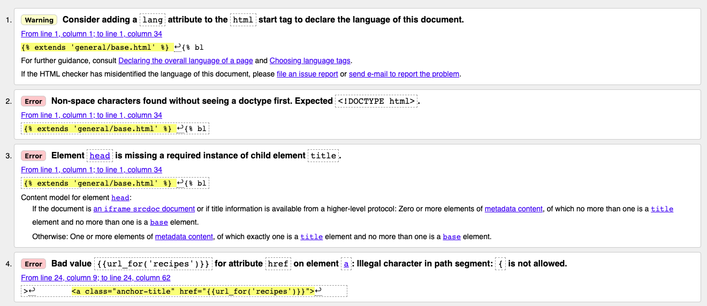
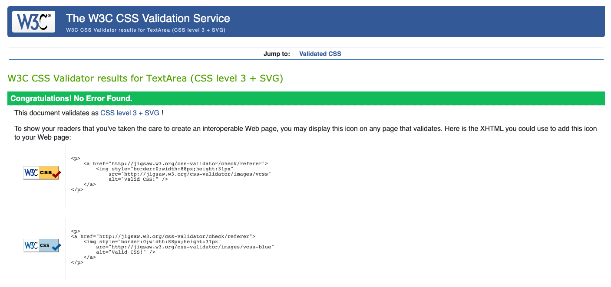
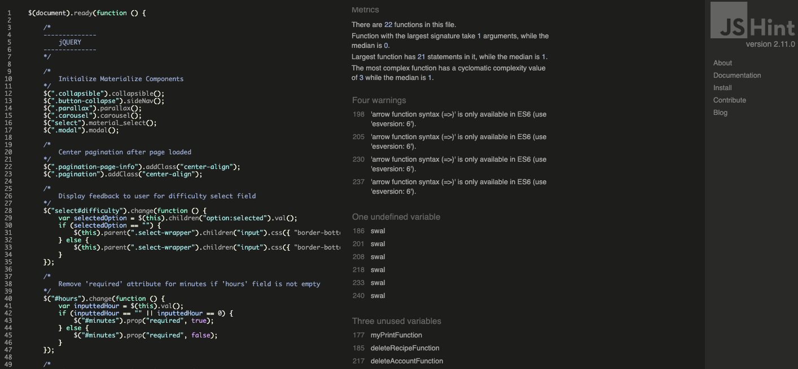
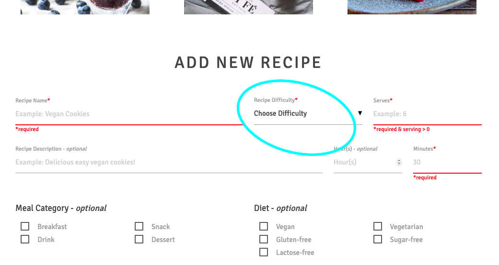
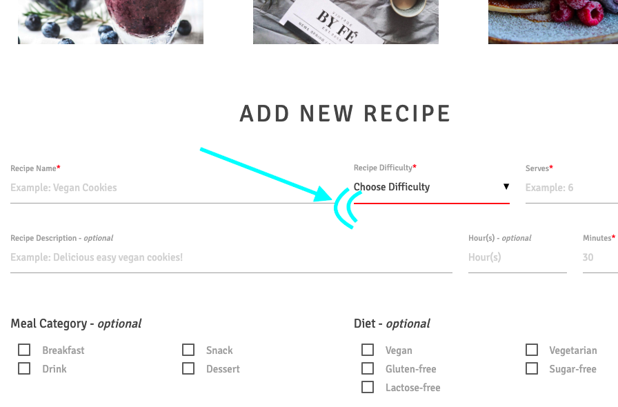
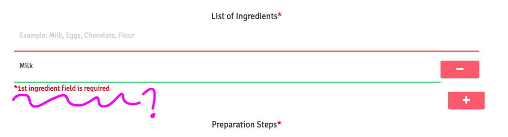
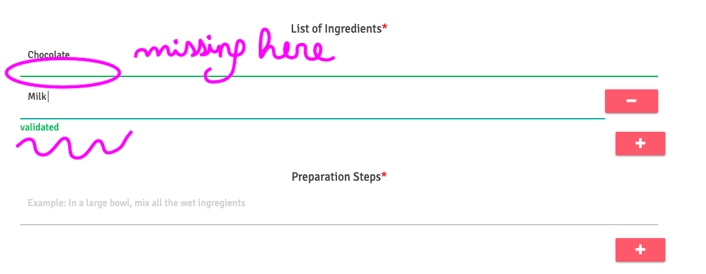

# Testing File

## Table of Contents

1. [Automated Testing](#automated-testing)

2. [User Stories Testing](#user-stories)
    - [External users](#external-users)
    - [Community members](#community-members)

3. [Testing Features](#testing-features)
    - [Features for all users](#all-users)
    - [Features for community members](#features-community)

4. [Compatibility & Responsiveness](#compatibility)

5. [Known issues](#known-issues)
    - [Solved](#solved)
    - [Unsolved](#unsolved)

<a name="automated-testing"/>

## Automated Testing

### Code quality

##### HTML5

HTML files were passed through this [HTML code validator](https://validator.w3.org/). All files were compliant at the exception of errors related to the use of jinja templating language that is currently not recognized by the code validator. You can see below a screenshot of these recurring errors:



##### CSS3

My css file succesfully passed this [CSS code validator](https://jigsaw.w3.org/css-validator/).



##### JS

My JS file was passed through [JS Hint](https://jshint.com/), please find below the information provided by the code validator. 

**Metrics:**
- There are 22 functions in this file. 
- Function with the largest signature take 1 arguments, while the median is 0.
- Largest function has 21 statements in it, while the median is 1.
-The most complex function has a cyclomatic complexity value of 3 while the median is 1.

**Warnings:**
- Arrow function syntax `=>` is only available in ES6 (use 'esversion: 6').

**1 undefined variable:**
- `swal` (used 4 times for Sweet Alert)

**3 unused variables:**
- `myPrintFunction` (function is invoked when print button is clicked)
- `deleteRecipeFunction`(function is invoked when delete recipe button is clicked)
- `deleteAccountFunction` (function is invoked delete account button is clicked)



##### Python

My [app.py](../app.py) file and [helpers.py](../herlpers.py) were passed through the [PEP8 Online Check](http://pep8online.com/). Both files are PEP8 compliant, I just have one error type (E501) "line too long (84 > 79 characters)" for my app.py. This is due to the fact that some lines in my file exceed 79 characters. I tried to find a way to solve it using a line wrapper to automatically magnify the file but it did not work in my gitpod IDE.

After discussing the issue with my mentor, he confirmed me that there was no problem keeping my file as it is. As long as the file is readable, this is not a common industry practice to keep the number of characters per line < 79 in python files.


<a name="user-stories"/>

## User Stories Testing

This project has been tested multiple times against each user stories previously listed in the UX section. 

<a name="external-users"/>

### External users

###### Testing user story 1 

**User story:** As an external user, I want to make use of the site and benefit from having convenient access to the data provided by all community members.

**Hypothesis:** The user should be logged out to perform this test.

**Test scenario:**
- [x] Click on the `EXPLORE` menu item in the navigation bar.
- [x] Leave the explore recipes form blank from any filters and click on the `SEARCH RECIPES` button.
- [x] You should have a total number of "x" recipes. TO BE UPDATED
- [x] Click on any of the recipes and you should be able to access the recipe description page without restriction.

**Test result:** Successful :white_check_mark:

###### Testing user story 2

**User story:** As an external user, I want to be able to research recipes based on specific criteria and have a visually appealing and interactive interface while I am cooking. 

**Hypothesis:** The user should be logged out to perform this test.

**Test scenario:**
- [x] Click on the `EXPLORE` menu item in the navigation bar.
- [x] In the explore recipes form, select "vegan" in the `Diet` field. 
- [x] Check that the recipes that are presented to you are indeed vegan. You can do so by performing random checks on some recipes, check that these recipes are flagged as vegan in the recipe description or check the recipe ingredients as well. 

**Test result:** Successful :white_check_mark:

###### Testing user story 3

**User story:** As an external user, I also want to be able to browse recipes by category types (meal, diet, occasion or geography) and then have a list of all the recipes available for the category I selected. 

**Hypothesis:** The user should be logged out to perform this test.

**Test scenario:**
- [x] Click on the `RECIPES` menu item in the navigation bar. You should be presented with the 4 following recipe categories:
    - occasion
    - geography
    - diet
    - meal
- [x] Click on the `Diet` category. You should be presented with the following diet categories:
    - vegan
    - vegetarian
    - gluten-free
    - sugar-free
    - lactose-free
- [x] Select the `Vegan` diet. You should have the same recipes list as for test case 2. 
- [x] Perform the same checks for other categories and sub-categories. 

**Test result:** Successful :white_check_mark:

###### Testing user story 4

**User story:** As a user with specific constraints (food allergies, specific diets or simply missing a cooking tool…), I want to be able to find recipes that address my needs and be presented recipes based on my inputs.

**Hypothesis:** The user should be logged out to perform this test.

**Test scenario:**
- [x] Click on the `EXPLORE` menu item in the navigation bar.
- [x] In the explore recipes form, set the following criteria for your search:
    - `Recipe Difficulty`-> "Medium"
    - `Max Serves`-> "5"
    - `Preparation Time`-> "< 1 hour"
    - `Diet`-> "Gluten-free" & "Lactose-free"
    - `Allergens`-> exclude: "Gluten", "Soy" & "Peanuts"
    - `Tools`-> exclude: "Blender", "Oven" & "Microwave"
- [x] You should have (at least) the following recipe: "Chestnut pancakes (gf)"
- [x] Get back to the form and then select "Eggs" as allergen. Then resubmitt your request.
- [x] The "Chestnut pancakes (gf)" recipe should have disappeared from the results as it contains eggs.

**Test result:** Successful :white_check_mark:

###### Testing user story 5

**User story:** As an external user, I want to be able to view the recipe instructions for all the recipes available in the database with the same level of details as a community member. I also want to be recommended some of the website creators' favorite recipes.  

**Hypothesis:** The user should be logged out to perform this test.

**Test scenario:**
- [x] Following the same steps from the previous test scenario, click on the "Chestnut pancakes (gf)"
- [x] Check that the following information are available in the recipe description:
    - recipe name 
    - serving size
    - diet 
    - difficulty
    - preparation time
    - button to share the recipe on social media
    - button to print the recipe
    - recipe picture
    - recipe description (if any)
    - ingredients list
    - cooking tools
    - preparation setps
    - carousel displaying recommended recipes

**Test result:** Successful :white_check_mark:

###### Testing user story 6

**User story:** As an external user, I want to be able to share recipes on different social platforms as well as be able to print them. 

**Hypothesis:** The user should be logged out to perform this test.

**Test scenario:**
- [x] Get back to the previous test case scenario. 
- [x] On the recipe description, click on the "share" button just above the recipe picture.
- [x] A modal form should open with the list of social media icons on which it's possible to share the recipe.
- [x] Click on each icon to check if a new window opens to share the recipe on the corresponding media platform. Remember that you have to be logged in on the social media to be able to view the recipe post. 
- [x] Get back to the recipe description and click on the "print" button just next to the "share" button. 
- [x] A preview print window should open displaying all the relevant information that pertain to the recipe.

**Test result:** Successful :white_check_mark:

###### Testing user story 7

**User story:** As an external user, I want to be able to create a free account with minimal steps.

**Hypothesis:** The user should be logged out to perform this test.

**Test scenario:**
- [x] Click on the `SIGN UP` menu item in the navigation bar.
- [x] Fill all the required information: First Name, Last Name, Email, Password and Confirm Password. Click the `SIGN UP` button. 
- [x] If you provided a valid email address and successfully confirmed your password, your account should have been created and you should have been redirected to the log in page. 

**Test result:** Successful :white_check_mark:

<a name="community-members"/>

### Community members

###### Testing user story 1

**User story:** As a community member, I want to be able to log in with minimal steps by only using my email and password for authentication. I also want to be able to log out easily.

**Hypothesis:** The user should already have registered to an account. 

**Test scenario:**
- [x] Click on the `LOG IN` menu item in the navigation bar.
- [x] Provide your email and password then click the `LOG IN` button. 
- [x] If you provided a valid email address and a correct password, you should be logged in and redirected to a personalized dashboard.
- [x] On the right of the navigation bar, you should now view a button to `LOG OUT`. Click this button and you should now be back to the Log In page.

**Test result:** Successful :white_check_mark:

###### Testing user story 2

**User story:** As a community member, I want to be able to edit my information details, password and delete my account permanently if necessary.

**Hypothesis:** The user should be logged in to perform this test. 

**Test scenario:**
- [x] After being logged in to your account, on your account dashboard, click on `Manage Account`.
- [x] You should view your account details via an non-editable form (First Name, Last Name, Email address).
- Edit account details
    - [x] Click on the `EDIT DETAILS` button. You should now be able to view an editable form.
    - [x] Amend your First Name, Last Name, Email address and click on the `EDIT ACCOUNT` button.
    - [x] You should be able to view your new account details. 
- Edit password
    - [x] Click on the `EDIT PASSWORD` button. You should now be able to view a form to amend your password. 
    - [x] Enter your current password, choose a new password and then confirm it, finally click on the `UPDATE PASSWORD` button.
    - [x] Your password should be updated. Log out and test logging in with this new password. 
- Delete account
    - [x] Get back to your account details page. At the bottom of the page below the `EDIT PASSWORD` button and above the footer, there should be a small paragraph saying "You want to delete your account? Click Here". Click on the `Here`anchor tag.
    - [x] Confirm your password and then press the `DELETE ACCOUNT` button. 
    - [x] A modal form should appear asking you to confirm your decision. Press the `Delete` button.
    - [x] You should be logged out and a message should confirm you that your account was deleted. 
    - [x] Try to log in with the previous credentials to check if your account has indeed been deleted.

**Test result:** Successful :white_check_mark:

###### Testing user story 3

**User story:** As a community member, I want to be able to create new recipes and then have the possibility to edit and/or to delete any of the recipes that I have shared with the community.

**Hypothesis:** The user should be logged in to perform this test. 

**Test scenario:**
- Add new recipe
    - [x] After being logged in to your account, on your account dashboard, click on `Add new recipe`.
    - [x] You should view a form to add a new recipe. Fill in all the madatory fields that are highlighted with a red star and then click on the `ADD RECIPE` button at the bottom of the form.
    - [x] If you filled in the form correctly, you should see a message confirming that your recipe was added succesfully. 
- Edit recipe
    - [x] Get back to your account dashboard and click on `Manage recipes`.
    - [x] You should have a list of recipe cards for all the recipes you have added. Choose the last recipe you just created and click the `EDIT` button. 
    - [x] You should view an editable form, pre-filled with the information of the recipe. Amend several fields such as the recipe name, recipe difficulty, serving size, add some ingredients etc... Click on the `EDIT RECIPE` button.
    - [x] Check that the amendments done to the recipe are now reflected in the recipe description.
- Delete recipe
    - [x] Get back to your account dashboard and click on `Manage recipes`.
    - [x] Delete your test recipe by clicking on the `DELETE` button. 
    - [x] A modal form should appear asking you to confirm your decision. Press the `Delete` button.
    - [x] A message should confirm you that your recipe was deleted. It should no longer be visible in your menu `Manage recipes`. 

**Test result:** Successful :white_check_mark:

###### Testing user story 4

**User story:** As a community member, I want to be able to add/remove a recipe to my favorites so I can create my own online cookbook. 

**Hypothesis:** The user should be logged in to perform this test. 

**Test scenario:**
- [x] Click on the `EXPLORE` menu item in the navbar, leave the form blank and then click on `SEARCH RECIPES` so you get all the recipes.
- [x] Pick one recipe that is currently not in your cookbook, click on the recipe to access its description.
- Add to favorites
    - [x] At the bottom of the recipe description, just above the carousel, you should see "Save as favorite?" as well as a pulse icon. 
    - [x] Click on the heart pusle icon to add the recipe as favorite.
    - [x] You should view a message confirming that the recipe was added to your favorites.
    - [x] Click on the `COOKBOOK` menu item to access your favorite recipes and double-check that the recipe was added.
- Remove from favorites
    - [x] Get back to the previous recipe that is now part of your cookbook.
    - [x] Go back to the bottom of the recipe description, you should now see "Remove from favorites?" with a pulse icon.
    - [x] Click on the bin pusle icon to remove the recipe from your favorites.
    - [x] You should view a message confirming that the recipe was removed from your favorites.
    - [x] Get back to your cookbook and check that the recipe was indeed removed.

**Test result:** Successful :white_check_mark:

###### Testing user story 5

This user story is out of testing scope.

## The site owners

These user stories are out of testing scope.

<a name="testing-features"/>

## Testing Features

<a name="all-users"/>

### Features for all users

###### Features on every pages

1. Navbar

**Test scenario:**
- [x] Check that each following menu items display correctly when the user is not logged in (and following this order): The Pâtisserie Logo, Home, Explore, Recipes, About, Sign Up and Log In. 
- [x] Hover over each menu items and confirm that the background colour changes from white to grey. 
- [x] Click on `The Pâtisserie` logo, it should take the user back to the home page.
- [x] Click on `Home`, it should take the user back to the home page.
- [x] Click on `Explore`, it should take the user to the explore recipes page.
- [x] Click on `Recipes`, it should take the user to the recipes by categories page.
- [x] Click on `About`, it should take the user to the about page.
- [x] Click on `Sign Up`, it should take the user to the sign up page.
- [x] Click on `Log In`, it should take the user to the log in page.

**Test result:** Successful :white_check_mark:

2. Footer 

**Test scenario:**
- [x] Confirm that the icons in the footer display correctly in the following order: Facebook, Instagram, Youtube, Pinterest and Twitter.
- [x] Hover over each icons and confirm that their colours change to the social media "referenced" colour. Example: Facebook icon should turn dark blue, Youtube icon should turn red...
- [x] Click on each social media icon, it should take the user to the corresponding social media page, opening in a new tab. It takes the user to the home page of each social media as this is a mock project - no account was created.  

**Test result:** Successful :white_check_mark:

###### Feature 1 - Home page

**Hypothesis:** The user should be logged out to perform this test.

**Test scenario:**
- [x] The title and the picture of the welcome page loaded successfully. 
- Our recipes section   
    - [x] When scrolling down, the user should first see a section teaser for recipes. 
    - [x] Confirm that the three pictures loaded successfully. 
    - [x] When the user hovers over `EXPLORE RECIPES`, the font colour should turn pink and the border below should expand. 
    - [x] Click on `EXPLORE RECIPES`, it should take the user to the explore recipes page. 
- Online cookbook section
    - [x] When scrolling down, the user should then see a section teaser for the online cookbook. 
    - [x] Confirm that the picture loaded successfully. 
    - [x] When the user hovers over `JOIN US`, the font colour should turn pink and the border below should expand. 
    - [x] Click on `JOIN US`, it should take the user to the sign up page. 
- About us section
    - [x] When scrolling down, the user should finally see a section teaser to present the website.  
    - [x] Confirm that the picture loaded successfully. 
    - [x] When the user hovers over `LEARN MORE`, the font colour should turn pink and the border below should expand. 
    - [x] Click on `LEARN MORE`, it should take the user to the sign up page. 

**Test result:** Successful :white_check_mark:

###### Feature 2 - Search recipes using a form

**Test scenario:**
- [x] The three pictures and the page title loaded successfully.
- [x] The form loaded successfully with the following fields:
    - recipe difficulty: confirm that the listings loaded for the dropdown menu and that only single selection is allowed.
    - preparation time: confirm that single selection is allowed.
    - max serving: confirm that fill can be filled by increment (using the arrow) or direct input. 
    - meal category: confirm that the listings loaded and multiple selection is allowed.
    - diet category: confirm that the listings loaded and multiple selection is allowed.
    - exclude allergens: confirm that the listings loaded for the dropdown menu and that multiple selection is allowed.
    - exclude specific tools: confirm that the listings loaded for the dropdown menu and that multiple selection is allowed.
    - occasion: confirm that the listings loaded for the dropdown menu and that multiple selection is allowed.
    - geography: confirm that the listings loaded for the dropdown menu and that multiple selection is allowed.
- [x] Leave all the fields blank, it should not prevent the user from submitting the form. 
- [x] Combine several fields to search for a recipe and confirm that the results match the criteria. More detailed tests were already done in the user stories testing section (user stories 2 & 4).
- [x] When search results are presented to the user, confirm that:
    - the number of recipes found is displayed in the title,
    - the recipe cards loaded successfully displaying the recipe title and an image,
    - when the user overs the recipe title/image, the title should turn pink,
    - clicking on the recipe title/image, should take the user to the recipe description page,
    - the pagination at the bottom of the page loaded successfully,
    - a maximum of 10 recipes per page should be displayed. 

**Test result:** Successful :white_check_mark:

###### Feature 3 - Browse recipes by categories type

**Test scenario:**
- [x] The pictures and the page title loaded successfully.
- [x] The following categories presented as image cards should be loaded: Occasion, Geography, Diet, Meal.
- [x] At the bottom of the page, a carousel presenting the website owners' favorite recipes should be displayed.
    - Carousel slides are not switched automatically, the user can click on the carousel to change slides. 
    - When the user clicks on the slide, it should take him to the corresponding recipe description page.
- [x] Click on the `Occasion` category, the the following sub-categories presented as image cards should be loaded: Christmas, New Year's, Hanukkah, Easter, Birthdays, Weddings, Thanksgiving, Halloween. 
    - Click on each occasion and confirm that the results displayed match the criteria of the occasion selected. 
    - Repeat this operation for each individual occasion.
- [x] Click on the `Geography` category, the following sub-categories presented as a simple list should be loaded: Africa, Asia, Europe, North America, South America, Middle East, Oceania. 
    - Click on each sub-category and confirm that the results displayed match the criteria of the geographical area selected. 
    - Repeat this operation for each geographical area.
- [x] Click on the `Diet` category, the following sub-categories presented as a simple list should be loaded: Vegan, Vegetarian, Gluten-free, Sugar-free, Lactose-free. 
    - Click on each diet and confirm that the results displayed match the criteria of the diet selected. 
    - Repeat this operation for each individual diet.
- [x] Click on the `Meal` category, the the following sub-categories presented as image cards should be loaded: Breakfast, Snack, Drink, Dessert.
    - Click on each meal cateogry and confirm that the results displayed match the criteria of meal category selected. 
    - Repeat this operation for each meal category. 
- [x] Confirm that the recipes results presented after selecting category, and then sub-category display: the number of results in the title, recipe image cards and pagination. 
- [x] Further testings were also performed in the user stories testing section (user story 3). 

**Test result:** Successful :white_check_mark:

###### Feature 4 - About us page

**Test scenario:**
- [x] The title and the picture of the welcome page loaded successfully. 
- [x] The 3 paragraphs presenting the project are displayed and easily readable.
- At the bottom of the page, there are three links to other pages of the website.
    - [x] When the user overs the title/image, the title should turn pink.
    - [x] Click on `Recipes` title/image, confirm that it takes the user to the recipes by categories page,
    - [x] Click on `Cookbook` title/image, confirm that it takes the user to their cookbook page (if logged in). If not logged in, the user should be taken to a personalized access denied page.
    - [x] Click on `Join us` title/image, confirm that it takes the user to the sign up page.

**Test result:** Successful :white_check_mark:

###### Feature 5 - Sign up for an account

**Hypothesis:** The user should be logged out to perform this test.

**Test scenario:**
- [x] Go the sign up page and confirm that the picture, title and the form loaded successfully.
- [x] Try to submit the form without filling any of the fields, this action should not be possible and an error message should be thrown. 
- [x] Try to submit the form with only one field missing, this action should not be possible and an error message should be thrown. 
- [x] Try to submit the form with an incorrect email address format, this action should not be possible and an error message should be thrown. 
- [x] Try to submit the form with "Password" field not matching "Confirm password" field, a red flash message should be thrown at the top of the form.
- [x] Submit the form with correct information, confirm that it takes the user to the log in page and a green flash message is thrown at the top of the form confirming that the account was created. 
- [x] Get back to the sign up form and try to create an other account using the email address you previously used, a red flash message should be thrown at the top of the form saying that an account already exists for this email address. 
- [x] At the bottom of the page a small paragraph should display "Already Have An Account? Log In", click on the `Log in` anchor tag and confirm that the user is taken to the log in form.

**Test result:** Successful :white_check_mark:

###### Feature 6 - View recipe description

This feature was thoroughly tested in the user stories section, please refer to the testing of user stories 5 & 6 for external users.

###### Feature 7 - Page not found / 404

**Test scenario:**
- [x] In the browser, type an incorrect URL and confirm that you land to a 404 page. 
- [x] Confirm that the gif is displaying correctly and that you have the possibility to get back to:
    - Home page if user is not logged in.
    - Account page if user is logged in.
- [x] Click on the button to be redirected to an existing page and confirm that it takes you to the corresponding URL (ie. home page or account page). 

**Test result:** Successful :white_check_mark:

###### Feature 8 - Access denied page

**Hypothesis:** The user should be logged out to perform this test.

**Test scenario:**
- [x] Try to access a page where log in is required such as the account page (`/account`), confirm that you get redirected to a personalized access denied page.
- [x] Click the `LOG IN` button and confirm that it takes you to the log in page.
- [x] Click the `SIGN UP` button and confirm that it takes you to the sign up page.

**Test result:** Successful :white_check_mark:

<a name="features-community"/>

### Features for community members

###### Navbar for logged user

**Test scenario:**
- [x] Check that each following menu items display correctly when the user is logged in (and following this order): The Pâtisserie Logo, Explore, Recipes, About, Cookbook, Account, and Log Out. 
- [x] Click on `Account`, it should take the user to a personalized account dashboard. 
- [x] Click on `Cookbook`, it should take the user to his cookbook page.
- [x] Click on `Log Out`, it should log the user out.

**Test result:** Successful :white_check_mark:

###### Feature 1 - Log in to their account

**Hypothesis:** The user should have already created an account. 

**Test scenario:**
- [x] Go the log in page and confirm that the picture, title and the form loaded successfully.
- [x] Try to submit the form without filling any of the fields, this action should not be possible and an error message should be thrown. 
- [x] Try to submit the form with only one field missing, this action should not be possible and an error message should be thrown. 
- [x] Try to submit the form with an incorrect email address format, this action should not be possible and an error message should be thrown. 
- [x] Try to submit the form with the email link to your existing account but with an incorrect password, you should be taken back to the log in form and a red flashed message should advise you that the login was unsuccessful. 
- [x] Submit the form with correct credentials, you should be taken to the account page, and a green flashed message should confirm you that your log in was successful. 
- [x] Log out and get back to the log in form. At the bottom of the page a small paragraph should display "Do You Need An Account? Sign Up", click on the `Sign Up` anchor tag and confirm that the user is taken to the sign up form.

**Test result:** Successful :white_check_mark:

###### Feature 2 - Log out

**Hypothesis:** You should be logged in to perform this test.

**Test scenario:**
- [x] Click on the `LOG OUT` link in the navigation bar, it should take the user back the log in page. 

**Test result:** Successful :white_check_mark:

###### Feature 3 - Account Dashboard

**Hypothesis:** You should be logged in to perform this test.

**Test scenario:**
- [x] Once log in form is submitted, confirm that the user is taken to a personalized account dashboard. 
- [x] The user should view a welcoming message in the title of this page saying "Hi <FIRST_NAME>, welcome!".
- [x] Confirm that the dashboard contains the following menu items presented as image cards:
    - `Manage account`
    - `Manage recipes`
    - `Add new recipe`
    - `My cookbook`
    - `Explore recipes`
- [x] Hover over the title/image for each menu items, and confirm that the title turns pink.
- [x] Click on the `Manage account` link, confirm that it takes the user to the manage account details page.
- [x] Click on the `Manage recipes` link, confirm that it takes the user to the manage recipes page.
- [x] Click on the `Add new recipe` link, confirm that it takes the user to the add new recipe form. 
- [x] Click on the `My cookbook` link, confirm that it takes the user to their cookbook page. 
- [x] Click on the `Explore recipes` link, confirm that it takes the user to the explore recipes form.

**Test result:** Successful :white_check_mark:

###### Feature 4 - Manage account details

**Hypothesis:** You should be logged in to perform this test.

**Test scenario:**
- [x] After landing on the page, confirm that the image and title loaded succesfully. 
- [x] Confirm that the account details displayed in the form are correct and the form is not editable. 
- [x] Click on the `Edit Details` button, confirm that it takes the user to an editable form.
- [x] Click on the `Edit Password` button, confirm that it takes the user to a form to edit its password. 
- [x] At the bottom of the page, the user should see a small paragraph displaying "You want to delete your account?", confirm that the user can get access to the delete account form by clicking on the anchor tag "Click Here". 

**Test result:** Successful :white_check_mark:

###### Feature 5 - Edit account details

**Hypothesis:** You should be logged in to perform this test.

**Test scenario:**
- [x] After landing on the page, confirm that the image and title loaded succesfully. 
- [x] The form should be pre-filled and editable.
- [x] Confirm that all fieds are mandatory and referenced as such with a red asterisk. 
- [x] Review the account details presented in the form, confirm that they are correct. 
- [x] Remove all information in each field of the form and confirm that the fields turned red and that the form cannot be submitted. 
- [x] Try to submit the form with one of the fields missing, or an incorrect format for the email address, confirm that the form cannot be submitted.
- [x] Now amend all your information in the form, click on the "Edit Account" button, confirm that it takes the user back to view its account details and that the information were indeed updated. You should also view a green flashed message confirming you that your account details were succesfully updated.
- [x] Try to amend only the email address, using my email address "alexia.delorme@gmail.com" that is already in the db. Confirm that the user gets redirected back to the form with a red flashed message saying that the email address provided is already linked to an existing account. 

**Test result:** Successful :white_check_mark:

###### Feature 6 - Edit password

**Hypothesis:** You should be logged in to perform this test.

**Test scenario:**
- [x] Confirm that all fieds are mandatory and referenced as such by a small red asterisk next to them.
- [x] Try to submit the form leaving all the fields empty, confirm that this is not possible. 
- [x] Try to submit the form with a wrong current password, confirm that the user gets redirected back to the form with a red flashed message saying that their current password is incorrect. 
- [x] Try to submit the form with:
    - correct current password
    - but, new password ≠ confirm new password
Confirm that the user gets redirected back to the form with a red flashed message saying that the two fields should be identical. 
- [x] Try to submit the form with:
    - correct current password
    - but, current password = new password = confirm new password
Confirm that the user gets redirected back to the form with a red flashed message saying that the new password should be different than old password. 
- [x] Finally, submit the form with a correctly that is to say:
    - correct current password
    - current password ≠ new password
    - new password = confirm new password
Confirm that the user gets redirected back to the view account details form page, with a green flashed message confirm the update of their password. 
- [x] Log out and then confirm that you can log in with your new credentials. 

**Test result:** Successful :white_check_mark:

###### Feature 7 - Delete account

**Hypothesis:** You should be logged in to perform this test.

**Test scenario:**
- [x] User can see a form with their email address (non-editable field) and a field to enter their password.
- [x] Try to submit the form without providing the password, it should not be possible.
- [x] Try to submit the form, click on the `DELETE ACCOUNT` button, confirm that a warning modal form appeared. Click on `Cancel`, confirm that the account was not deleted.
- [x] Try to submit the form, click on the `DELETE ACCOUNT` button, confirm that a warning modal form appeared. Click on `Delete`, confirm that the user receives a confirmation of the deletion through the modal form. The user then gets redirected to the home page with a grey flashed message. 
- [x] Try to submit the form with an incorrect password, click on the `DELETE ACCOUNT` button, confirm that a warning modal form appeared. Click on `Delete`, even though the user is confirmed that his account was deleted, the user gets redirected back to the form and a red flashed message appears confirming that the account has not been deleted because the password provided was incorrect. 

**Test result:** Successful :white_check_mark:

###### Feature 8 - Online cookbook

**Hypothesis:** You should be logged in to perform this test.

**Test scenario:**
- [x] Click on the "cookbook" menu item in the navigation bar, confirm that it takes you to your favorite recipes.
- [x] After landing on the page, confirm that the image and title of the page loaded succesfully. 
- [x] The list of favorite recipes are displayed as recipe cards with the recipe name and picture. 
- [x] Hover over the title/image for each image cards, and confirm that the title turns pink.
- [x] At the botton of the page, confirm that there is a shortcut link to add new recipe. Click on the link and confirm that it takes you to a form to add a new recipe. 
- [x] Click on a recipe card, confirm that it takes you to the corresponding recipe description.

**Test result:** Successful :white_check_mark:

###### Feature 9 - Add a recipe

**Hypothesis:** You should be logged in to perform this test.

**Test scenario:**
- [x] Try to submit the form leaving all the fields empty, confirm that this is not possible. 
- [x] Confirm that all mandatory fields are referenced thanks to a small red asterisk and optional fields are specified as such. 
- [x] Try to submit the form leaving all optional fields empty, confirm that the form can be submitted. 
- Checking each fields specificity:
    - [x] Recipe name: confirm that this field is mandatory, if empty a red "*required" message should appear below the field, all alphanumeric characters are allowed but only a maximum of 50 is allowed. If the field is correct, a "validated" message in gree should appear below the field.
    - [x] Recipe difficulty: confirm that this field is mandatory, the listings for the dropdown menu loaded and that only single selection is allowed.
    - [x] Serving: confirm that the field is mandatory, if empty a red "*required & serving >0" message should appear below the field, only numerical values are allowed, minimum value should be 1 and maximum value should be 15. If the field is correct, a "validated" message in green should appear below the field.
    - [x] Recipe description: confirm that this field is optional, all alphanumeric characters are allowed but only a maximum of 100 is allowed.
    - [x] Hours & Minutes: confirm that minutes are mandatory and hours are optional, if minutes are empty a red "*required" message should appear below the field, only numerical values are allowed and max value for minutes is 59. 
    - [x] Meal/Diet Category: confirm that this field is optional, all checkbox options are displaying correctly, multiple selection is allowed. 
    - [x] Occasion/Geography/Allergens/Tools: confirm that this field is optional, the listings for the dropdown menu loaded and that multiple selection is allowed. 
    - [x] List of Ingredients: at least one ingredient is mandatory, if field is empty a red "*required" message should appear below the field, all alphanumeric characters are allowed but only a maximum of 100 is allowed. The user can click on the `+` button to add a new ingredient, a new ingredient line should appear with a `-` button to delete the latter. 
    - [x] List of Instructions: at least one instruction is mandatory, if field is empty a red "*required" message should appear below the field, all alphanumeric characters are allowed but only a maximum of 500 is allowed. The user can click on the `+` button to add a new instruction, a new instruction line should appear with a `-` button to delete the latter. 
    - [x] Add Image: confirm that this field is optional, all alphanumeric characters are allowed (the user should copy/paste a direct URL to his image).
    - [x] Add to favorites: optional field, this toggle button can be clicked to directly add the recipe to the user's cookbook. 
- [x] Fill in all the mandatory fields and confirm that the recipe form is submitted succesfully. 
    - Confirm that if no picture is provided, then a default picture is added to the recipe.
    - Confirm that the recipe is added to the user's cookbook, when the "Add to favorites" button is activated.
- [x] When the recipe is added, the user receives feedback thanks to a green flashed message and is redirected to "my recipes" page. 

**Test result:** Successful :white_check_mark:

###### Feature 10 - Edit a recipe

**Hypothesis:** You should be logged in to perform this test.

**Test scenario:**
- [x] Confirm that the form displayed is pre-filled with the existing information of the recipe. 
- [x] Confirm that you can edit the form without any issues.  
- [x] Confirm that all mandatory fields are referenced thanks to a small red asterisk and optional fields are specified as such. 
- [x] Check each fields specificity as done in the testing of the add recipe feature below. 
... TO BE FINISHED - ISSUE TO BE RESOLVED

**Test result:** Successful :white_check_mark:

###### Feature 11 - Delete a recipe

**Hypothesis:** You should be logged in to perform this test.

**Test scenario:**
- [x] In the "Manage recipes" page, click on the `DELETE` button below the recipe card, confirm that a warning modal form appeared.
- [x] Click on `Cancel`, confirm that the recipe was not deleted.
- [x] Click on `Delete`, confirm that the recipe was deleted succesfully. 
- [x] If the recipe was saved as favorite, confirm that it was also removed from the cookbook. 

**Test result:** Successful :white_check_mark:

###### Feature 12 - Add/Remove favorites

This feature was thoroughly tested in the user stories section, please refer to the testing of user story 4 for community members. 

<a name="compatibility"/>

## Compatibility & Responsiveness

A cross browser testing was performed for each features:
- Safari
- Google Chrome 
- Mozilla Firefox
- Internet Explorer
- Opera 

The responsiveness of the webiste was tested thanks to Google Chrome developer tool, the following devices size were tested and all elements were displayed without issues:
- Galaxy S5 
- Pixel 2 / Pixel 2 XL 
- iPhone 5/SE
- iPhone 6/7/8 and Plus
- iPhone X 
- iPad / iPad Pro 

<a name="known-issues"/>

## Known Issues

<a name="solved"/>

While testing this project some bugs were discovered and they have been documented in the section down below. 

### Solved Issues

1. Recipe difficulty field (add/edit recipe forms)

While testing the form to add a recipe, I realized that there was no feedback provided to the user if the latter tried to submit the form without selecting a recipe difficulty. 

This is coming from the fact that the `.validate` class used with for `<select>` elements do not properly work with Materialize. As you can see in the picture down below, no feedback was provided for difficulty field while for other fields, they are being underlined in red. 



To solve this issue I decided to manually amend the CSS style according to the input's value. I have not used a data-error/data-success attribute to display a message as for the fields that require direct inputs (like servings etc...) since the value for difficulty is directly picked up and should not have any formatting issues. 

```
$("select#difficulty").change(function(){
    var selectedOption = $(this).children("option:selected").val();
    if (selectedOption == "") {
        $(this).parent(".select-wrapper").children("input").css({"border-bottom": "1px solid #f44336", "box-shadow": "0 1px 0 0 #f44336"});
    } else {
        $(this).parent(".select-wrapper").children("input").css({"border-bottom": "1px solid #4CAF50", "box-shadow": "0 1px 0 0 #4CAF50"});
    };
});
```
I also had to remove the `disabled` attribute that would normally be used as a prompt to select options. This was the only way to correctly display the red border-bottom and therefore make the feedback relevant for users who forgot to update this field. 

`<option value="" selected>Choose Difficulty</option>`

Please see below the resolved bug: 



2. No feedback when user adds new item to ingredient/instruction list (add/edit recipe forms)

I introduced a function to prevent the user from adding a new ingredient if the last ingredient field is empty.

3. Feedback for ingredient/instruction fields (add/edit recipe forms)

Being a direct text input field `<textarea>`, I decided to add a label for this element and to use data-error and data-success attributes to display customized error/validate messages to provide feedback on user inputs. The issue is that this "input field" for ingredients/instructions is a list. So when the user adds new ingredients/instructions to the list, the feedback is provided only for the first field as it is the first element encontered in the DOM with ID ingredients/instructions. I was therefore faced with multiple issues as shown in the screenshots down below:
    - there is no data-error/data-success feedback for each individual field 
    - the content for data-error/data-success appears after the total list (`label::after`) but the feedback only pertains to the first ingredient field





This created a very confusing feedback for the user and the only way to clear that was to remove the data-error/data-success attributes. The user still gets feedback thanks to the color of the border-bottom for each individual field but I wanted my form to remain harmonized in terms of feedback. 

I have therefore introduced two anonymous functions to provide feedback to the user. Below each ingredient/instruction field I have added an empty div with a class of `.alert-div`. When the user changes the textarea field (with a class of `.manual-feedback`), it will add the class `.data-success-manual` to the `.alert-div` element and shows "validated". If the textarea field remains empty then it will display "*required" in red thanks to `.data-error-manual` class. 

```
function feedbackChangeFunction() {
    $(".manual-feedback").change(function () {
        var field = $(this).val();
        if (field == "") {
            $(this).siblings(".alert-div").removeClass("data-success-manual").addClass("data-error-manual").text("*required");
        } else {
            $(this).siblings(".alert-div").removeClass("data-error-manual").addClass("data-success-manual").text("validated");
        }
    });
}

function feedbackFocusFunction() {
    $(".manual-feedback").focusout(function () {
        var field = $(this).val();
        if (field == "") {
            $(this).siblings(".alert-div").removeClass("data-success-manual").addClass("data-error-manual").text("*required");
        } else {
            $(this).siblings(".alert-div").removeClass("data-error-manual").addClass("data-success-manual").text("validated");
        }
    });
}
feedbackFocusFunction();
feedbackChangeFunction();
```

These two functions where also added the `addIngredientsFunction()` and the `addInstructionsFunction()` as event listeners so the script would also apply to newly added field items! 

<a name="unsolved"/>

### Unsolved Issues

That I am aware of, there are currently no unsolved issues/bugs for this project. 

